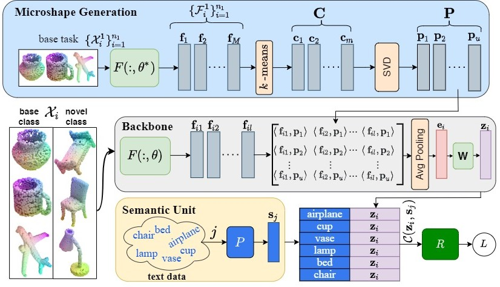

# FSCIL 3D

**[Few-shot Class-incremental Learning for 3D Point Cloud Objects, ECCV 2022](https://www.ecva.net/papers/eccv_2022/papers_ECCV/html/3641_ECCV_2022_paper.php)**
<br>
Townim Chowdhury, Ali Cheraghian, Sameera Ramasinghe, Sahar Ahmadi, Morteza Saberi, Shafin Rahman
<br>

This paper addresses the problem of few-shot class incremental learning for the 3D domain alongside the domain gap from synthetic to real objects.
<br>

<p align="center">

Figure: Overall Architecture
</p>

## Dependencies
FSCIL 3D is implemented in [PyTorch](https://pytorch.org/) and tested with Ubuntu 20.04.2 LTS, please install PyTorch first in the official instruction. You can also install the anaconda environment using the provided [environment.yml](environment.yml) file.


## Configurations

Here, we only include the configuration for the large cross-dataset experiment: [ShapeNet](https://shapenet.cs.stanford.edu/shapenet/obj-zip/ShapeNetCore.v1.zip) -> [CO3D](https://ai.facebook.com/datasets/CO3D-dataset/). The configuration files are in [configs](confgs/) folder.


You can create similar configuration files for other experimental setups.

## Dataset

Please check the readme file in [here](data/dataset/README.md).

## K-Means

You can build your own centroids with this [code](knn_centroids.py).

## Command

```shell
python train_pointnet_incremental_with_knn_with_w2v.py
```

For this [ShapeNet](https://shapenet.cs.stanford.edu/shapenet/obj-zip/ShapeNetCore.v1.zip) -> [CO3D](https://ai.facebook.com/datasets/CO3D-dataset/) experiment, we provide required centroids and model [here](https://drive.google.com/drive/folders/1lqi91B5wNDDaRwUTEuBsNxzPV5z8zbb5?usp=sharing).

## Citation

```bibtex
@inproceedings{FSCIL3D,
  title={Few-shot Class-incremental Learning for 3D Point Cloud Objects},
  author={Chowdhury, Townim and Cheraghian, Ali and Ramasinghe, Sameera and Ahmadi, Sahar and Saberi, Morteza and Rahman, Shafin},
  booktitle={ECCV},
  year={2022}
}

```
